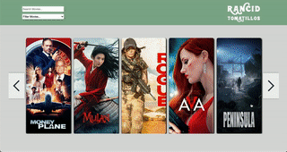

# Rancid Tomatillos 

Take a look at some movies to find the next blockbuster smash!

## Technologies Used

* `React`
* `React Router`
* `Cypress`

## Overview

This project emulates the functions of a movie website by allowing users to view a carousel of movies, sort by rating/release date/title, & view movie details. It uses React Router to create a multi-page experience. All data is fetched from a remote API. Cypress integration testing was incorporated to make sure user flows behave as expected.

## Goals & Objectives

* Design & build an app using the React framework
* Send requests to API endpoints for data retrieval/manipulation
* Testing user flows using Cypress

## Setup (using command line)

1. Fork this repo, then install the project on your local machine by entering `git clone`
2. Install the necessary packages & dependencies by entering `npm install`
3. Start the React server by entering `npm start`
5. To use the app enter `http://localhost:3000/` in your browser

* To run the tests enter `npx cypress open`

## Using the App:

- Use the arrow left/right buttons to scroll through the movie carousel
- Click on a movie to view more details
- Search & filter movies using the tools at the top left of the page header

## Road Map
##### Plans for future updates:

* User profile & ability to login
* Ability for user to post rate a movie
* Link to purchase tickets to upcoming movies
* Movie preview videos

## Preview

## Deployed Site

[Rancid Tomatillos](http://greedy-distance.surge.sh/)

## Authors

[Ryan Miller](https://github.com/ryan-d-miller)

[Chris Anderson](https://github.com/mistercanderson)
